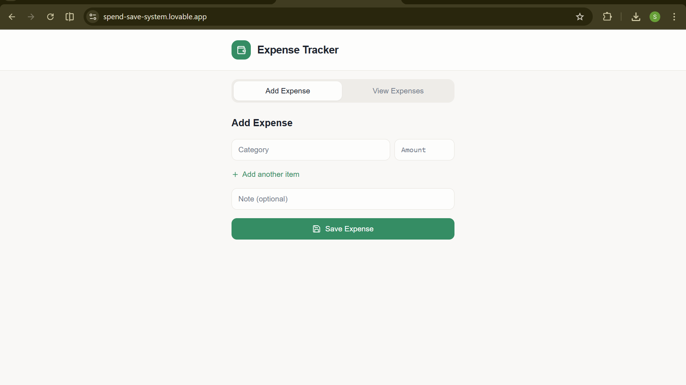
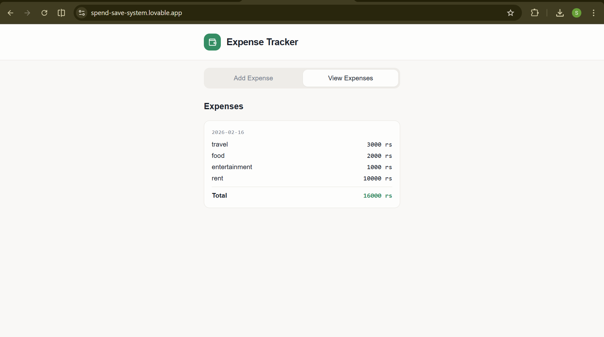

# Expense Tracker 💸

A simple expense tracker application that started as a Python-based CLI program and was later converted into a web application using Lovable.

## 🔗 Live Demo
 https://spend-save-system.lovable.app

##  Preview

##  Features
- Add expenses with category and amount
- Optional notes for each entry
- View all expenses with total calculation
- Data persistence in the web version
- Clean and minimal UI

##  Tech Stack
- Python (backend logic)
- Lovable (UI & web conversion)
- HTML, CSS, JavaScript (generated)
- Local storage for data persistence

##  What I Learned
- Structuring a Python project
- Converting backend logic into a web interface
- Basic frontend architecture
- Deploying and sharing a live web app
- Writing clean project documentation

##  Future Improvements
- User authentication
- Monthly expense breakdown
- Charts and analytics
- Database integration
- Full backend–frontend connection

##  About Me
I’m a first-year CSE student comfortable with Python, currently working on DSA in Java.  
I’m passionate about Machine Learning and Cyber Security, and I enjoy building practical projects that solve real problems.

